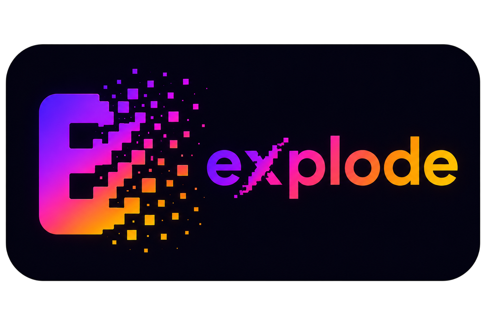

<p align="center">
  
</p>

<h1 align="center">explode</h1>

<p align="center">
  <a href="https://pub.dev/packages/explode"></a>
  <a href="LICENSE"></a>
  <a href="https://pub.dev/packages/explode/score"></a>
  
  
</p>

## Description

A lightweight Flutter package that turns any widget into a satisfying particle explosion. Wrap your UI, trigger the blast with an `ExplodeController`, and watch the child shatter into colorful particles with physics-based motion.

## Features

- Pixel-perfect explosion by sampling the child widget into particles
- Programmatic control via `ExplodeController` (`explode()` and `reset()`)
- Customizable particle shapes: circle, rectangle, and triangle
- Adjustable animation duration for fast, normal, or slow effects
- Control particle density with `particleSize` or `particleCount`
- Constrain spread with `explodeArea` for tight or wide blasts
- Works with simple widgets and complex UI layouts

## Explode Types

<table>
<tr>
<td width="40%"><b>Default effect</b><br/>Out-of-the-box explosion with circle particles and standard duration.</td>
<td align="center"></td>
</tr>
</table>

<table>
<tr>
<td width="40%"><b>Particle shapes</b><br/>Choose circle, rectangle, or triangle particles for a different visual style.</td>
<td>
<table>
<tr>
<td align="center"><br/><sub>Circle</sub></td>
<td align="center"><br/><sub>Rectangle</sub></td>
<td align="center"><br/><sub>Triangle</sub></td>
</tr>
</table>
</td>
</tr>
</table>

<table>
<tr>
<td width="40%"><b>Effect speed</b><br/>Tune `duration` to make particles burst quickly or drift slowly.</td>
<td>
<table>
<tr>
<td align="center"><br/><sub>Fast</sub></td>
<td align="center"><br/><sub>Normal</sub></td>
<td align="center"><br/><sub>Slow</sub></td>
</tr>
</table>
</td>
</tr>
</table>

<table>
<tr>
<td width="40%"><b>Particle size & count</b><br/>Use `particleSize` or `particleCount` to control how fine or dense the blast looks.</td>
<td>
<table>
<tr>
<td align="center"><br/><sub>Small</sub></td>
<td align="center"><br/><sub>Large</sub></td>
<td align="center"><br/><sub>Count</sub></td>
</tr>
</table>
</td>
</tr>
</table>

<table>
<tr>
<td width="40%"><b>Complex UI</b><br/>Explode rich layouts such as profile cards and buttons without extra setup.</td>
<td>
<table>
<tr>
<td align="center"><br/><sub>Profile card</sub></td>
<td align="center"><br/><sub>Button</sub></td>
</tr>
</table>
</td>
</tr>
</table>

<table>
<tr>
<td width="40%"><b>Explode area</b><br/>Set `explodeArea` to limit how far particles travel from the widget.</td>
<td>
<table>
<tr>
<td align="center"><br/><sub>Small area</sub></td>
<td align="center"><br/><sub>Large area</sub></td>
</tr>
</table>
</td>
</tr>
</table>

## Examples

### Simple Example

```dart
import 'package:explode/explode.dart';
import 'package:flutter/material.dart';

void main() => runApp(const MyApp());

class MyApp extends StatelessWidget {
  const MyApp({super.key});

  @override
  Widget build(BuildContext context) {
    return MaterialApp(
      home: Scaffold(
        body: Center(child: ExplodeDemo()),
      ),
    );
  }
}

class ExplodeDemo extends StatefulWidget {
  const ExplodeDemo({super.key});

  @override
  State<ExplodeDemo> createState() => _ExplodeDemoState();
}

class _ExplodeDemoState extends State<ExplodeDemo> {
  final ExplodeController _controller = ExplodeController();

  @override
  Widget build(BuildContext context) {
    return Explode(
      controller: _controller,
      child: ElevatedButton(
        onPressed: () => _controller.explode(),
        child: const Text('Explode!'),
      ),
    );
  }
}
```

### Advanced Example

```dart
import 'package:explode/explode.dart';
import 'package:flutter/material.dart';

class AdvancedExplodeDemo extends StatefulWidget {
  const AdvancedExplodeDemo({super.key});

  @override
  State<AdvancedExplodeDemo> createState() => _AdvancedExplodeDemoState();
}

class _AdvancedExplodeDemoState extends State<AdvancedExplodeDemo> {
  final ExplodeController _controller = ExplodeController();

  @override
  Widget build(BuildContext context) {
    return Explode(
      controller: _controller,
      duration: const Duration(milliseconds: 750),
      shape: ExplodeParticleShape.triangle,
      particleCount: 400,
      explodeArea: const Size(180, 180),
      child: Card(
        child: ListTile(
          leading: const CircleAvatar(child: Icon(Icons.person)),
          title: const Text('Tap to explode'),
          subtitle: const Text('Custom shape, speed, count & area'),
          onTap: () => _controller.explode(),
        ),
      ),
    );
  }
}
```

See the [`example`](example/) app for a full interactive demo covering all explode types.

## Installation

Add `explode` to your `pubspec.yaml`:

```yaml
dependencies:
  explode: ^1.0.0
```

Then run:

```bash
flutter pub get
```

## License

This project is licensed under the MIT License — see the [LICENSE](LICENSE) file for details.
