[](https://pub.dev/packages/explode)
[](https://opensource.org/licenses/MIT)
[](https://pub.dev/packages/explode)


## Description

A lightweight Flutter package that turns any widget into a satisfying particle explosion. Wrap your UI, trigger the blast with an `ExplodeController`, and watch the child shatter into colorful particles with physics-based motion.

## Features

- Pixel-perfect explosion by sampling the child widget into particles
- Programmatic control via `ExplodeController` (`explode()` and `reset()`)
- Customizable particle shapes: circle, rectangle, and triangle
- Adjustable animation duration for fast, normal, or slow effects
- Control particle density with `particleSize` or `particleCount`
- Constrain spread with `explodeArea` for tight or wide blasts
- Works with simple widgets and complex UI layouts

## Explode Types

### Default effect

Out-of-the-box explosion with circle particles and standard duration.

<p align="center">
  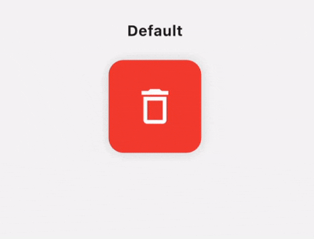
</p>

### Particle shapes

Choose circle, rectangle, or triangle particles for a different visual style.

<table border="0" cellspacing="0" cellpadding="8" rules="none" frame="void">
<tr>
<td align="center" width="33%" style="border: none;">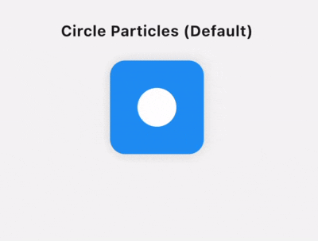<br/><sub>Circle</sub></td>
<td align="center" width="33%" style="border: none;">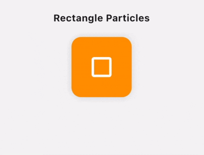<br/><sub>Rectangle</sub></td>
<td align="center" width="33%" style="border: none;">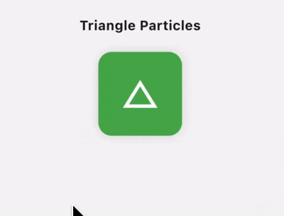<br/><sub>Triangle</sub></td>
</tr>
</table>

### Effect speed

Tune `duration` to make particles burst quickly or drift slowly.

<table border="0" cellspacing="0" cellpadding="8" rules="none" frame="void">
<tr>
<td align="center" width="33%" style="border: none;">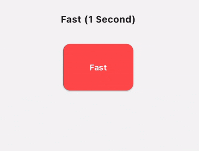<br/><sub>Fast</sub></td>
<td align="center" width="33%" style="border: none;">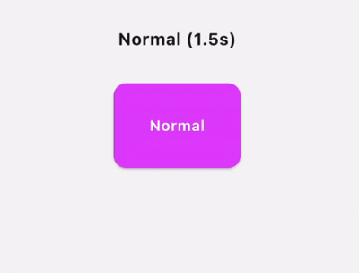<br/><sub>Normal</sub></td>
<td align="center" width="33%" style="border: none;">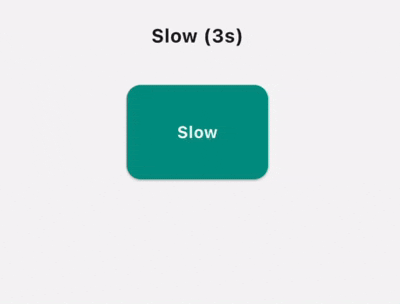<br/><sub>Slow</sub></td>
</tr>
</table>

### Particle size & count

Use `particleSize` or `particleCount` to control how fine or dense the blast looks.

<table border="0" cellspacing="0" cellpadding="8" rules="none" frame="void">
<tr>
<td align="center" width="33%" style="border: none;">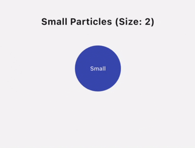<br/><sub>Small</sub></td>
<td align="center" width="33%" style="border: none;">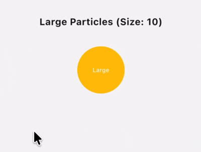<br/><sub>Large</sub></td>
<td align="center" width="33%" style="border: none;">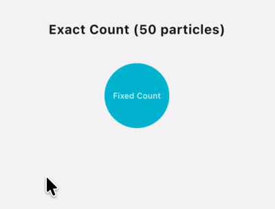<br/><sub>Count</sub></td>
</tr>
</table>

### Complex UI

Explode rich layouts such as profile cards and buttons without extra setup.

<table border="0" cellspacing="0" cellpadding="8" rules="none" frame="void">
<tr>
<td align="center" width="50%" style="border: none;">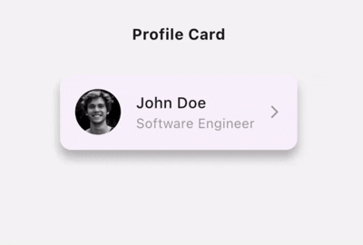<br/><sub>Profile card</sub></td>
<td align="center" width="50%" style="border: none;">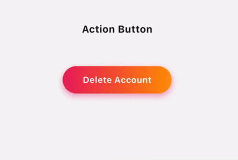<br/><sub>Button</sub></td>
</tr>
</table>

### Explode area

Set `explodeArea` to limit how far particles travel from the widget.

<table border="0" cellspacing="0" cellpadding="8" rules="none" frame="void">
<tr>
<td align="center" width="50%" style="border: none;">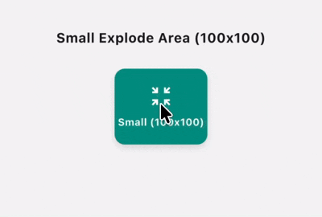<br/><sub>Small area</sub></td>
<td align="center" width="50%" style="border: none;">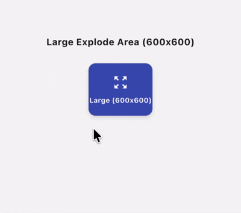<br/><sub>Large area</sub></td>
</tr>
</table>

## Examples

### Simple Example

```dart
Explode(
  controller: controller,
  child: GestureDetector(
    onTap: controller.explode,
    child: Container(
      padding: const EdgeInsets.all(24),
      decoration: const BoxDecoration(color: Colors.amber, shape: BoxShape.circle),
      child: const Icon(Icons.auto_awesome, size: 48, color: Colors.white),
    ),
  ),
)
```

### Advanced Example

```dart
Explode(
  controller: controller,
  duration: const Duration(milliseconds: 750),
  shape: ExplodeParticleShape.triangle,
  particleCount: 400,
  explodeArea: const Size(180, 180),
  child: GestureDetector(
    onTap: controller.explode,
    child: Container(
      padding: const EdgeInsets.symmetric(horizontal: 24, vertical: 16),
      decoration: BoxDecoration(
        gradient: const LinearGradient(colors: [Colors.purple, Colors.deepPurple]),
        borderRadius: BorderRadius.circular(20),
      ),
      child: const Text('🎁  Open Gift', style: TextStyle(color: Colors.white, fontSize: 18, fontWeight: FontWeight.w600)),
    ),
  ),
)
```

See the [`example`](example/) app for a full interactive demo covering all explode types.

## Installation

Add `explode` to your `pubspec.yaml`:

```yaml
dependencies:
  explode: ^1.0.0
```

Then run:

```bash
flutter pub get
```

## License

This project is licensed under the MIT License — see the [LICENSE](LICENSE) file for details.
